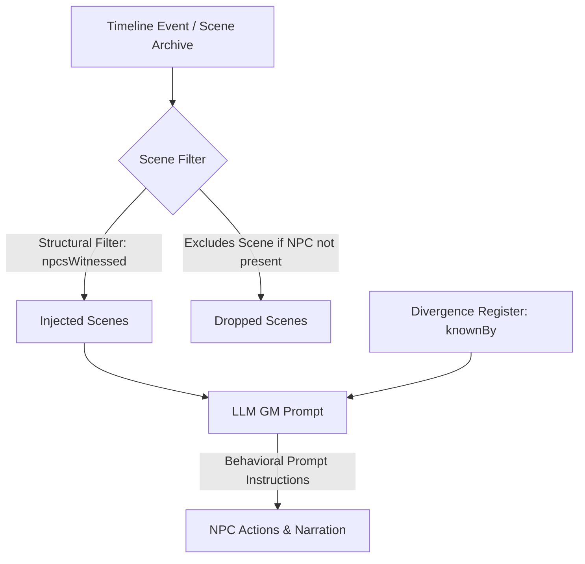

# Witness Integrity Model: Structural vs. Behavioral Boundaries

This document outlines the design, architecture, and limitations of the witness integrity enforcement mechanism in the Narrative Engine's context pipeline.

---

## The Hybrid Witness Model

The system enforces witness boundaries and keeps non-present NPCs from acting on player/GM events they didn't witness through a **hybrid** approach:

### 1. Structural Layer: Scene-Recall Filtering
The primary hard boundary is at the retrieval step in the context pipeline:
* When fetching historical scenes for turn context, `filterRecallByPerception` checks the `npcsWitnessed` metadata on the index entries.
* If a scene's recorded witnesses do not match any currently active or on-stage NPCs, the entire scene content is filtered out before it ever reaches the LLM GM.
* **Result:** The LLM cannot hallucinate or act on verbatim scene details that the current scene's NPCs could not possibly know because that text is completely omitted from the context.

### 2. Behavioral Layer: Divergence Register & `knownBy` Partition
The divergence register tracks facts that have diverged from pre-established campaign canon. 
* While rendering the divergence register payload (`renderRegisterForPayload`), the system partitions facts into an **on-stage block** (facts known to present characters) and an **off-stage block** (facts bounded by a `knownBy` array).
* Both blocks are ultimately serialized into the **same system message** to the LLM GM.
* Because the LLM GM receives the entire register, it technically has full visibility over all diverged facts, regardless of which NPC witnessed them.
* The separation into on-stage/off-stage is **advisory** rather than structurally isolating: it relies on the model's **behavioral compliance** (following system instructions to restrict NPC knowledge to what is labeled in their respective blocks).

---

## Design Rationale

This hybrid model balances context-window constraints, API cost, and semantic coherence:
1. **Verbatim scenes are heavy:** Filtering entire scenes structurally at retrieval saves thousands of tokens and prevents cross-contamination of detailed dialogue or narration.
2. **Abstract facts are light:** Injecting the unified divergence register keeps the GM informed of the state of the world globally (e.g., who is dead or alive), while using prompt engineering to guide the GM's roleplaying of individual NPCs.
3. **Behavioral enforcement is robust:** High-quality instruction-following models (such as Claude/GPT/Gemini Pro) are highly capable of ignoring off-stage facts when instructed, making the behavioral boundary reliable in practice.
